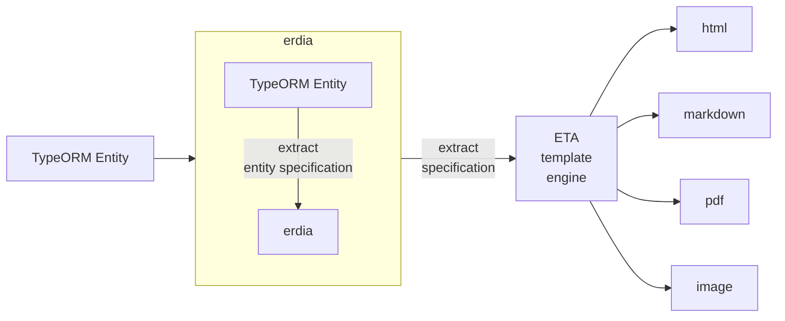

# ERDIA

erdia is create ER Diagram and Entity schema specification using by TypeORM and mermiad.js


[](https://npmcharts.com/compare/erdia?minimal=true)
[](https://github.com/imjuni/erdia)
[](https://github.com/imjuni/erdia/issues)
[](https://www.npmjs.com/package/erdia)
[](https://github.com/imjuni/erdia/blob/master/LICENSE)
[](https://github.com/imjuni/fast-maker/actions/workflows/ci.yml)
[](https://codecov.io/gh/imjuni/fast-maker)
[](https://github.com/prettier/prettier)

Why `erdia` ?

`erdia` is a cli tool that allows you to automatically generate DB specifications and ER diagram documents using TypeORM. It is very hard to be diligent about updating DB specifications and ER diagrams whenever code and DB changes. `erdia` automatically generates DB statement and ER diagram documents using information provided by TypeORM whenever the code changes. By automatically generating documents using TypeORM code, you can maintain the freshness of your documents with minimal effort.

Summary,

1. ER diagram generate using [mermaid.js](http://mermaid.js.org/) syntax.
2. Every document generate using [ETA](https://eta.js.org/) template engine
3. Use [TypeORM](https://typeorm.io/)

Automate your database ER diagram drawing!

## Table of Contents <!-- omit in toc -->

- [How it works?](#how-it-works)
- [Getting started](#getting-started)
  - [Installation](#installation)
  - [Confuguration](#confuguration)
  - [Generation](#generation)
- [Usage](#usage)
  - [Commands](#commands)
  - [CLI Options](#cli-options)
- [Programming Interfaces](#programming-interfaces)
  - [Interfaces](#interfaces)
  - [Function Options](#function-options)
- [Requirement](#requirement)
- [Example](#example)
  - [Showcase](#showcase)
  - [Documents](#documents)
- [Output Format](#output-format)
- [Template](#template)
- [TypeScript](#typescript)
- [License](#license)
- [References](#references)

`erdia` support initialization command. And you execute `build` command.

## How it works?



## Getting started

### Installation

```bash
npm install erdia --save-dev
```

### Confuguration

```bash
npx erdia init
```

### Generation

```bash
erdia build -d [your dataSource path] -o dist/entity --format html
```

## Usage

### Commands

`erdia` supports the `build`, `clean`, `init`, and `eject` commands.

| Command | Description                                                 |
| ------- | ----------------------------------------------------------- |
| build   | Builds the erdiagram document.                              |
| init    | Generates a configuration file for creating erdiagrams.     |
| eject   | Generates a template document file for creating erdiagrams. |
| clean   | Deletes the previously built erdiagram document.            |

### CLI Options

- [build options](./docs/DETAIL_BUILD_COMMAND_OPTION.md#build-command-cli-options)
- init options
- [eject options](./docs/DETAIL_EJECT_COMMAND_OPTION.md#eject-command-cli-options)
- [clean options](./docs/DETAIL_CLEAN_COMMAND_OPTION.md#clean-command-cli-options)

## Programming Interfaces

### Interfaces

| Command      | Description                                                 |
| ------------ | ----------------------------------------------------------- |
| building     | Builds the erdiagram document.                              |
| initializing | Generates a configuration file for creating erdiagrams.     |
| ejecting     | Generates a template document file for creating erdiagrams. |
| cleaning     | Deletes the previously built erdiagram document.            |

### Function Options

- [build options](./docs/DETAIL_BUILD_COMMAND_OPTION.md#building-function-options)
- init options
- [eject options](./docs/DETAIL_EJECT_COMMAND_OPTION.md#eject-function-options)
- [clean options](./docs/DETAIL_CLEAN_COMMAND_OPTION.md#clean-function-options)

## Requirement

- TypeORM 0.3.x

## Example

### Showcase


### Documents

- [ER diagram html format](./assets/html/index.html)
- [ER diagram png image format](./assets/erdiagram.png)
- [ER diagram & table pdf format](./assets/erdiagram.pdf)

## Output Format

`erdia` support html, markdown, pdf, svg, png. Database entity specification table only support html, markdown, pdf format.

```bash
# PDF document generate
erdia build -d [your dataSourcePath] -o dist/entity --format pdf
```

## Template

`erdia` use ETA template for entity specification document and ER diagram. Template easily detach from erdia.

```bash
npx erdia eject
```

Detached template can change and every document customizable. The template can be found [here](https://github.com/imjuni/erdia/tree/master/src/template).

## TypeScript

If you are using TypeScript, you must use `ts-node` or `tsx` to run `erdia`. This is because the TypeORM Entity file is written in TypeScript.

- [ts-node](./docs/DETAIL_TYPESCRIPT.md#ts-node)
- [tsx](./docs/DETAIL_TYPESCRIPT.md#tsx)
- [scripts](./docs/DETAIL_TYPESCRIPT.md#using-programming-interfaces)

## License

This software is licensed under the [MIT](LICENSE).

## References

- [TypeORM](https://typeorm.io/)
- [ER Diagram](https://en.wikipedia.org/wiki/Entity%E2%80%93relationship_model)
