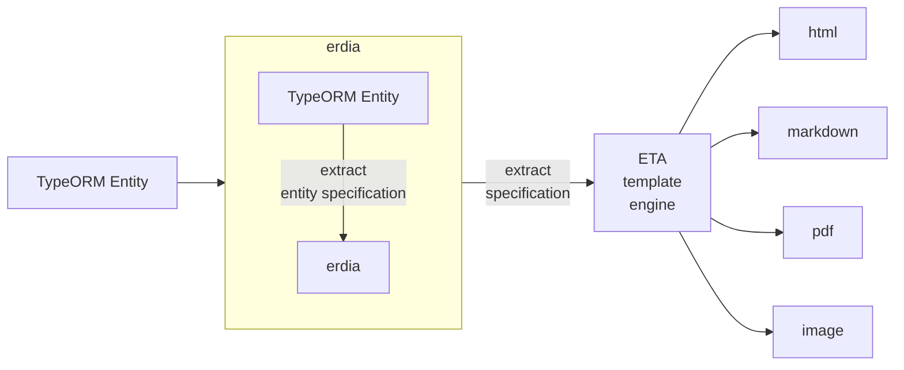

# ERDIA

erdia is create ER Diagram and Entity schema specification using by TypeORM and mermiad.js


[](https://npmcharts.com/compare/erdia?minimal=true)
[](https://github.com/imjuni/erdia)
[](https://github.com/imjuni/erdia/issues)
[](https://www.npmjs.com/package/erdia)
[](https://github.com/imjuni/erdia/blob/master/LICENSE)
[](https://github.com/imjuni/fast-maker/actions/workflows/ci.yml)
[](https://codecov.io/gh/imjuni/fast-maker)
[](https://github.com/prettier/prettier)

Why `erdia` ?

`erdia` automatic generate DB entity specification, ER diagram. DB entity specification, ER diagram important document that are maintainence and develop process. But not so easy keep freshness. `erdia` help to easily keep freshness and easily generate beautiful document using [ETA](https://eta.js.org/) template engine.

Summary,

1. ER diagram generate using [mermaid.js](http://mermaid.js.org/) syntax.
1. Every document generate using [ETA](https://eta.js.org/) template engine
1. Use [TypeORM](https://typeorm.io/)

Automate your database ER diagram drawing!

## Table of Contents <!-- omit in toc -->

- [Getting started](#getting-started)
- [How it works?](#how-it-works)
- [Installation](#installation)
- [Usage](#usage)
- [Requirement](#requirement)
- [Example](#example)
  - [Showcase](#showcase)
  - [Documents](#documents)
- [Output Format](#output-format)
- [Template](#template)
- [TypeScript and Re-Map Paths](#typescript-and-re-map-paths)

## Getting started

```sh
npm install erdia --save-dev
npx erdia init
npx erdia build
```

`erdia` support initialization command. And you execute `build` command.

## How it works?



## Installation

installation

```bash
npm i erdia --save-dev
```

initialization

```bash
npx erdia init
```

## Usage

```sh
erdia build -d [your dataSource path] -o dist/entity --format html
```

## Requirement

- TypeORM 0.3.x

## Example

### Showcase


### Documents

- [ER diagram png image format](./assets/erdiagram.png)
- [ER diagram & table pdf format](./assets/erdiagram.pdf)

## Output Format

`erdia` support html, markdown, pdf, svg, png. Database entity specification table only support html, markdown, pdf format.

```sh
# PDF document generate
erdia build -d [your dataSourcePath] -o dist/entity --format pdf
```

## Template

`erdia` use ETA template for entity specification document and ER diagram. Template easily detach from erdia.

```bash
npx erdia eject
```

Detached template can change and every document customizable. The template can be found [here](https://github.com/imjuni/erdia/tree/master/src/template).

## TypeScript and Re-Map Paths

```sh
TS_NODE_PROJECT="./tsconfig.json" ts-node -r tsconfig-paths/register ./node_modules/.bin/erdia er -d [your dataSource path]
```

`erdia` load dataSource file using TypeORM module. If you use module resolution need additional parameter need for successfully execution. You have to pass tsconfig-paths/register. See ts-node [paths and baseUrl](https://github.com/TypeStrong/ts-node#paths-and-baseurl) section
