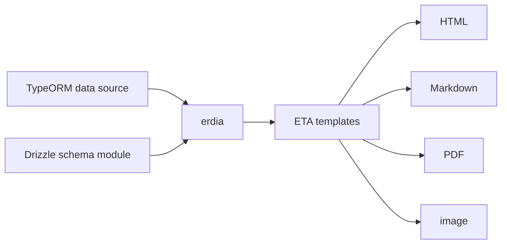

# ERDIA

erdia generates ER diagrams and entity specifications from TypeORM or Drizzle schemas using Mermaid.js.

 [](https://npmcharts.com/compare/erdia?minimal=true) [](https://github.com/imjuni/erdia) [](https://github.com/imjuni/erdia/issues) [](https://www.npmjs.com/package/erdia) [](https://github.com/imjuni/erdia/blob/master/LICENSE) [](https://github.com/imjuni/fast-maker/actions/workflows/ci.yml) [](https://codecov.io/gh/imjuni/fast-maker) [](https://github.com/prettier/prettier)

Why `erdia`?

`erdia` is a CLI tool that generates database specifications and ER diagrams from TypeORM data sources or Drizzle schema modules. Regenerate the documents when your schema changes to keep them current.

In brief:

1. Generate ER diagrams using [Mermaid.js](https://mermaid.js.org/) syntax.
2. Generate documents using the [ETA](https://eta.js.org/) template engine.
3. Load schemas from [TypeORM](https://typeorm.io/) or [Drizzle ORM](https://orm.drizzle.team/).

Automate your database ER diagram drawing!

## Table of Contents <!-- omit in toc -->

- [How it works?](#how-it-works)
- [Getting started](#getting-started)
  - [Installation](#installation)
  - [Configuration](#configuration)
  - [Generation](#generation)
- [Usage](#usage)
  - [Commands](#commands)
  - [CLI Options](#cli-options)
- [Programming Interfaces](#programming-interfaces)
  - [Interfaces](#interfaces)
  - [Function Options](#function-options)
- [Requirement](#requirement)
- [Example](#example)
  - [Showcase](#showcase)
  - [Documents](#documents)
- [Output Format](#output-format)
- [Template](#template)
- [TypeScript](#typescript)
- [License](#license)
- [References](#references)

Use `init` to create a configuration file, then run `build` to generate documents.

## How it works?


```mermaid
graph LR

A[TypeORM data source] --> C[erdia]
B[Drizzle schema module] --> C
C --> D[ETA templates]
D --> E[HTML]
D --> F[Markdown]
D --> G[PDF]
D --> H[image]
```

## Getting started

### Installation

```bash
npm install erdia --save-dev
```

### Configuration

```bash
npx erdia init
```

### Generation

For TypeORM, pass a data source path. `--orm typeorm` is accepted but optional because TypeORM is the default:

```sh
erdia build -d src/dataSource.ts -o dist/entity --format html
```

For Drizzle, pass a schema module and select `--orm drizzle`:

```sh
erdia build --orm drizzle -d src/schema.ts -o dist/entity --format html
```

The Drizzle module must export its tables. Export any `relations(...)` definitions from the same module to include application-level relationships in the diagram.

## Usage

### Commands

`erdia` supports the `build`, `clean`, `init`, and `eject` commands.

| Command | Description                                                 |
| ------- | ----------------------------------------------------------- |
| build   | Builds the erdiagram document.                              |
| init    | Generates a configuration file for creating erdiagrams.     |
| eject   | Generates a template document file for creating erdiagrams. |
| clean   | Deletes the previously built erdiagram document.            |

### CLI Options

`--orm` accepts `typeorm` and `drizzle`. If omitted, it defaults to `typeorm`. The `-d` (`--data-source-path`) option points to a TypeORM data source or a Drizzle schema module according to the selected ORM.

- [build options](./docs/DETAIL_BUILD_COMMAND_OPTION.md#cli-options)
- init options
- [eject options](./docs/DETAIL_EJECT_COMMAND_OPTION.md#eject-command-cli-options)
- [clean options](./docs/DETAIL_CLEAN_COMMAND_OPTION.md#clean-command-cli-options)

## Programming Interfaces

### Interfaces

| Command      | Description                                                 |
| ------------ | ----------------------------------------------------------- |
| building     | Builds the erdiagram document.                              |
| initializing | Generates a configuration file for creating erdiagrams.     |
| ejecting     | Generates a template document file for creating erdiagrams. |
| cleaning     | Deletes the previously built erdiagram document.            |

### Function Options

- [build options](./docs/DETAIL_BUILD_COMMAND_OPTION.md#building-options)
- init options
- [eject options](./docs/DETAIL_EJECT_COMMAND_OPTION.md#eject-function-options)
- [clean options](./docs/DETAIL_CLEAN_COMMAND_OPTION.md#clean-function-options)

## Requirement

- Node.js 20 or later
- TypeORM 0.3.x for TypeORM schemas, or Drizzle ORM for Drizzle schemas

## Example

### Showcase


### Documents

- [ER diagram html format](./assets/html/index.html)
- [ER diagram png image format](./assets/erdiagram.png)
- [ER diagram & table pdf format](./assets/erdiagram.pdf)
- [Runnable examples (English)](./examples/examples.md)

## Output Format

`erdia` support html, markdown, pdf, svg, png. Database entity specification table only support html, markdown, pdf format.

```bash
# PDF document generate
erdia build -d [your dataSourcePath] -o dist/entity --format pdf
```

## Template

`erdia` use ETA template for entity specification document and ER diagram. Template easily detach from erdia.

```bash
npx erdia eject
```

Detached template can change and every document customizable. The template can be found [here](https://github.com/imjuni/erdia/tree/master/src/template).

## TypeScript

If your TypeORM data source or Drizzle schema is written in TypeScript, use `ts-node` or `tsx` to run `erdia`.

- [ts-node](./docs/DETAIL_TYPESCRIPT.md#ts-node)
- [tsx](./docs/DETAIL_TYPESCRIPT.md#tsx)
- [scripts](./docs/DETAIL_TYPESCRIPT.md#using-programming-interfaces)

## License

This software is licensed under the [MIT](LICENSE).

## References

- [TypeORM](https://typeorm.io/)
- [Drizzle ORM](https://orm.drizzle.team/)
- [ER Diagram](https://en.wikipedia.org/wiki/Entity%E2%80%93relationship_model)
