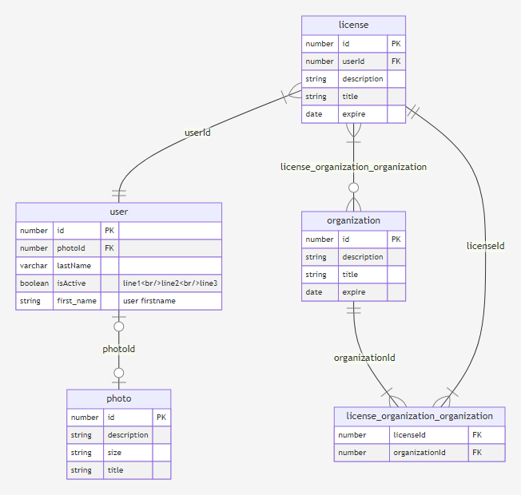

# ERdia

ERdia is create ER Diagram and Entity schema specification using by TypeORM and mermiad.js


[](https://npmcharts.com/compare/erdia?minimal=true)
[](https://github.com/imjuni/erdia)
[](https://github.com/imjuni/erdia/issues)
[](https://www.npmjs.com/package/erdia)
[](https://github.com/imjuni/erdia/blob/master/LICENSE)
[](https://github.com/imjuni/fast-maker/actions/workflows/ci.yml)
[](https://codecov.io/gh/imjuni/fast-maker)
[](https://github.com/prettier/prettier)

Why `ERdia` ?

`erdia` automatic create DB entity specification, ER diagram. DB entity specification, ER diagram important document that are maintainence and develop process. But not so easy keep freshness. `erdia` help to easily keep freshness and easily create beautiful document using [EJS](https://ejs.co) template engine.

Summary,

1. ER diagram create using [mermaid.js](http://mermaid.js.org/) syntax.
1. Every document create using EJS template engine
1. Only need TypeORM configuration

Automate your database ER diagram drawing!

## Table of Contents <!-- omit in toc -->

- [Showcase](#showcase)
- [Getting started](#getting-started)
- [How it works?](#how-it-works)
- [Installation](#installation)
- [Usage](#usage)
- [Requirement](#requirement)
- [Example](#example)
- [Output Format](#output-format)
- [TypeScript and Re-Map Paths](#typescript-and-re-map-paths)

## Showcase




## Getting started

```sh
npm install erdia --save-dev
npx erdia init
npx erdia build
```

`erdia` support initialization command. And you execute `build` command.

## How it works?


## Installation

```basn
npm i erdia --save-dev
```

## Usage

```sh
erdia build -d [your dataSource path] -o dbdoc --format html
```

## Requirement

- TypeORM 0.3.x

## Example

- [ER diagram png image format](./assets/erdiagram.png)
- [ER diagram pdf format](./assets/erdiagram.pdf)
- [Entity definition table pdf format](./assets/table.pdf)

## Output Format

ERdia support html, markdown, pdf, svg, png. Database entity specification table only support html, markdown, pdf format.

```sh
# PDF document generate
erdia build -d [your dataSourcePath] -o db.pdf --format pdf
```

## TypeScript and Re-Map Paths

```sh
ts-node -r tsconfig-paths/register ./node_modules/.bin/erdia er -d [your dataSource path]
```

ERdia load dataSource file using TypeORM module. If you use module resolution need additional parameter need for successfully execution. You have to pass tsconfig-paths/register. See ts-node [paths and baseUrl](https://github.com/TypeStrong/ts-node#paths-and-baseurl) section
