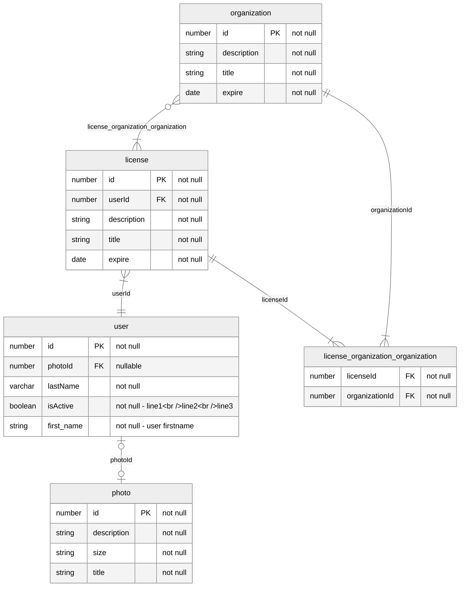

```
erDiagram

user {
  number id PK "not null"
  number photoId FK "nullable"
  varchar lastName "not null"
  boolean isActive "not null - line1&lt;br /&gt;line2&lt;br /&gt;line3"
  string first_name "not null - user firstname"
}

photo {
  number id PK "not null"
  string description "not null"
  string size "not null"
  string title "not null"
}

license {
  number id PK "not null"
  number userId FK "not null"
  string description "not null"
  string title "not null"
  date expire "not null"
}

organization {
  number id PK "not null"
  string description "not null"
  string title "not null"
  date expire "not null"
}

license_organization_organization {
  number licenseId FK "not null"
  number organizationId FK "not null"
}

license }|--|| user: "userId"
license ||--|{ license_organization_organization: "licenseId"
organization }o--|{ license: license_organization_organization
organization ||--|{ license_organization_organization: "organizationId"
user |o--o| photo: "photoId"
```
